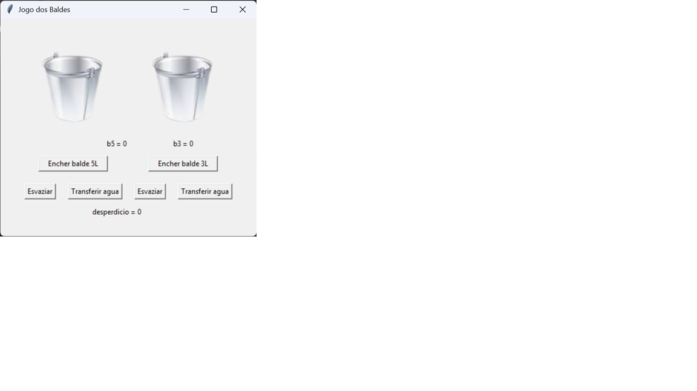
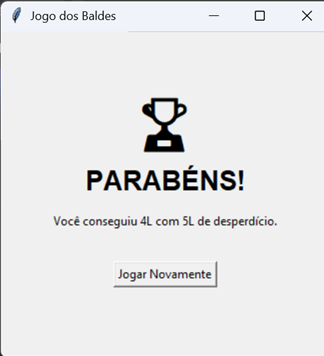

# 🚰 Desafio dos Dois Baldes (3L e 5L)


Este projeto é um jogo de lógica desenvolvido como um desafio pessoal durante as aulas de **Algoritmos** no 1º semestre de Análise e Desenvolvimento de Sistemas na **FATEC**. O objetivo é manipular baldes de 3 e 5 litros para obter exatamente 4 litros de água.

## 🚀 O Desafio
O jogador deve utilizar as operações de encher, esvaziar e transferir água entre os baldes. O jogo termina quando o balde de 5L contiver exatamente 4L.

## 🛠️ Tecnologias e Ferramentas
* **Linguagem:** Python 3
* **Interface Gráfica:** Tkinter
* **Editor:** Visual Studio Code
* **Controle de Versão:** Git / Git Bash

## 📸 Demonstração



## 🏁 Como Rodar
1. Certifique-se de ter o Python instalado.
2. Clone o repositório:
   ```bash
   git clone [https://github.com/SEU_USUARIO/algortimo-dois-baldes.git](https://github.com/SEU_USUARIO/algortimo-dois-baldes.git)
